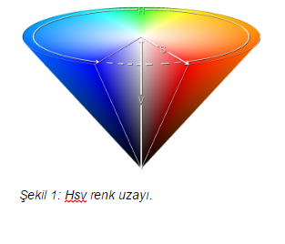
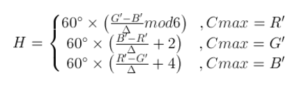
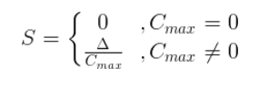
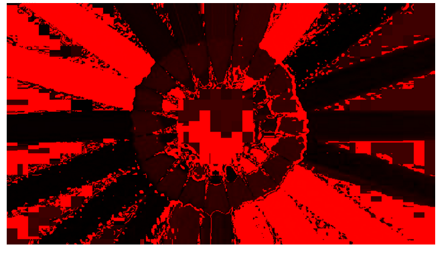

= RGB renk uzayından HSV renk uzayına çevirme +

== 1) İçindekiler 
. İçindekiler
. Versiyon Geçmişi
. Giriş
. HSV Renk Uzayı
.. HSV Modelleme
. Python ile HSV Renk Uzayı’na Çevirme Uygulaması
. Uygulama Görüntüleri
. Referanslar

== 2) Versiyon Geçmişi
|===
|Tarih|Değişiklik|Kişi

|05.01.2017
|

|Gönül Toktay
|05.01.2017
 
|
|M.Sıla Genç

|30.01.2017

|Düzenleme
|Merve Tafralı

|===

== 3) Giriş

Bu bölümde RGB renk uzayında tanımlanmış bir görüntünün nasıl HSV renk uzayına dönüşümü anlatılmıştır. RGB renk uzayı ile HSV renk uzayı arasındaki farklar ve RGB renk uzayındaki bir görüntünün HSV renk uzayına nasıl aktarıldığı ve modellemenin nasıl yapıldığı anlatılmıştır. Örnek olarak Python dili ile bir uygulama geliştirilmiştir.

== 4)  HSV Renk Uzayı

RGB renk uzayı genel olarak kullandığımız renk uzayıdır. Bu renk uzayında üç ana bileşen kullanılır. Görüntü r, g, b yani kırmızı, yeşil, mavi renk kodları üzerine tanımlanır. Her piksel bu renk kodlarına göre ara değerler alır. Böylece renkli bir resim elde edebiliyoruz. +

HSV renk uzayı ise Hue(Renk), Saturation(Doygunluk) ve Value(Parlaklık) terimleri ile rengi tanımlar. RGB de renklerin karışımı kullanılmasına karşın HSV de renk, doygunluk ve parlaklık değerleri kullanılır. Doygunluk rengin canlılığını belirlerken parlaklık rengin aydınlığını ifade eder. Örneğin; HSV uzayında siyah renk için renk ve doygunluk değerleri 0 ile 255 arasında herhangi bir alabilir iken parlaklık değeri sıfırdır. Beyaz renkte ise parlaklık değeri 255'dir. Buna göre herhangi bir bilgisayarlı görme/görüntü işleme uygulamasında belirli renkteki bir nesneyi ayırt etmek istediğimizde HSV renk uzayını kullanmak daha elverişlidir. Çünkü RGB renk uzayında eşik değeri için kullanacağımız filtreler yerine burada sadece Hue bileşeni ile eşik değeri belirleyebiliriz. Daha net renkler elde edebiliriz. 1978 yılında Alvy Ray Smith tarafından RGB uzayına göre insan görme sistemine daha benzer bir yapı oluşturmak amacıyla tanımlandı. Şekil 1’de görüleceği üzere H değeri 0-360° arasında değişirken renklerin öz değerleri değişir. Ancak H sabit olarak seçilir ve diğer değerler (S-V) 0-100 arasında değiştirilirse aynı rengin farklı doygunluk ve parlaklıktaki değerleri elde edilir. Bu özelliğinden dolayı HSV renk temelli ayırma işlemlerinde sıklıkla tercih edilir. İki uzay arasındaki dönüşüm doğrusal olmayan bir bağlantı ile gerçekleştirilir. +

=== 4.1) HSV Modelleme

RGB renk uzayından HSV renk uzayına geçiş yapmak için belirli formüller kullandık. Burada dikkat edilmesi gereken nokta RGB değerlerini 0-1 arasına indirilmesi gerekliliğidir. Her pikselin değeri 255 ile bölünerek normalize edildikten sonra aşağıdaki formüller ile HSV değerleri bulunabilir. +

İlk olarak görüntünün piksel değerlerinde bulunan renk kodları alınır. +
R' = R/255 +
G' = G/255 +
B' = B/255 +

Cmax = max (R', G', B') +
Cmin = min (R', G', B') +
Δ = Cmax - Cmin +

Hue(Renk) değeri için hesaplama: +
 +

Saturation(Doygunluk) değeri için hesaplama: +

Value(Parlaklık) değeri için hesaplama: +

V = Cmax +

== 5)  Python ile HSV Renk Uzay’ına Çevirme Uygulaması

[source,python]
---------------------------------------------------------------------

from PIL import Image 		

#PIL modülünden Image kütüphanesi eklenmiştir.

def rgbtohsv(r, g, b): 		

#Kullanacağımız fonksiyonun 'rgbtohsv' adında int türünde 'r,g,b' adlı üç parametre ile kullanmaktadır.

    r, g, b = r/255.0, g/255.0, b/255.0  
    
    #Aldığımız r,g,b değişkenlerini normalize hale getirmek için yani 0-1 değerleri arasına almak için her değişkeni 255 sayısına bölüyoruz.
    
    Cmax = max(r, g, b)		 #Yeni değerlerini hesapladığımız r,g,b değişkenleri arasından en büyük olanı bulup 'Cmax' değişkenine atıyoruz. 
    
    Cmin = min(r, g, b)		
    #Yeni değerlerini hesapladığımız r,g,b değişkenleri arasından en küçük olanı bulup 'Cmin' değişkenine atıyoruz.
    
    delta = Cmax - Cmin 	
    
    #Formülde belirtilen delta değişkenini hesaplamak için en büyük değerden en küçük değeri çıkarıyoruz. Böylece orta bir değer hesaplanır.
    
    if delta == 0:	
    
    #Hue bileşenini bulmak; yani 'h' değişkeni için, eğer en küçük ve en büyük değer eşit ise hue(renk) bileşenine '0' değeri atanır.
    
        h = 0
    elif Cmax == r: 	
    
    #Eğer bulunan en büyük değer r(kırmızı) değişkenine eşitse formüldeki denklem uygulanır. En son 360 ile mod işlemi yapılmasının nedeni raporda belirtildiği gibi Hue bileşeni derece cinsinden değer almaktadır. Bu yüzden 360 üzerinden mod alınarak derecesi hesaplanır.
    
        h = (60 * ((g-b)/delta)) % 360
    elif Cmax == g: 	
    
    #Eğer bulunan en büyük değer g(yeşil) değişkenine eşitse formüldeki denklem uygulanır. Burada +2 kullanılmasının nedeni 360 derecelik Hue bileşeninde yeşil renginin başlangıç açısı 120 derecesine denk gelmektedir.
    
        h = (60 * ((b-r)/delta) + 2) % 360      
    elif Cmax == b:	 
    
    #Eğer bulunan en büyük değer b(mavi) değişkenine eşitse formüldeki denklem uygulanır. Burada +4 kullanılmasının nedeni 360 derecelik Hue bileşeninde mavi renginin başlangıç açısı 240 derecesine denk gelmektedir.
    
        h = (60 * ((r-g)/delta) + 4) % 360      
        
    if Cmax == 0:		
    
    #Saturation bileşenini bulmak; yani 's' değişkeni için, eğer 'Cmax' en büyük değişkenimiz '0' ise s değişkenine 0 atıyoruz.
    
        s = 0
    else:
        s = delta/Cmax      
        
        #Değilse formülde gösterildiği gibi, bulduğumuz delta değişkenini en büyük değere bölüyoruz.
        
    v = Cmax            #Value bileşenini en büyük değer oluşturmaktadır.
    
    h=int(h)       
    
    #Son olarak görüntümüzdeki piksel değerleri int türünde olduğundan tüm değişkenlere tür dönüşümü yapılır.
    
    s=int(s) 
    v=int(v)
    return h, s, v      
    
    #Tür dönüşümü yapılan değerler geri gönderilir.

image=Image.open("image.jpg")	

#image değişkeninin içerisine proje klasörümüzde bulunan 'image' adlı resim dosyasını atıyoruz.

image_pix = image.load()	

#image_pix adlı yeni bir matris oluşturup bunun içerisine resim dosyamızı yüklüyoruz.

wdh=image.size[0]	

#wgh değişkenine resim dosyasının genişlik boyutunu atıyoruz. Dosyamızın genişliği 640 piksel.

hgh=image.size[1]           

#hgh değişkenine resim dosyasının yükseklik boyutunu atıyoruz. Dosyamızın yüksekliği 360 piksel.

for i in range(wdh):       

#Görüntünün tüm piksellerinde bulunan renk kodlarını almak için iç içe döngü oluşturuyoruz.

    for j in range(hgh):
        r, g, b = image.getpixel((i, j))	 
        
        #Her pikselde birer r(kırmızı),g(yeşil),b(mavi) değeri bulunmaktadır. Bunlar o piksele renk veren kodlardır. Öncelikle 'getpixel' fonksiyonu ile bu değerleri r,g,b değişkenlerine atıyoruz. 
        h, s, v = rgbtohsv(r, g, b)		
        
        #Alınan r,g,b değişkenler rgbtohsv fonksiyonuna gönderilir. Bu fonksiyonun geri dönüşü üç parametre olacaktır. Bunları da h,s,v değişkenlerinde saklıyoruz.
        
        image_pix[i,j] = (h, s, v)     	 
        
        #Fonksiyondan elde ettiğimiz h,s,v değerlerimizi görüntünün uygun piksellerine yeni değer olarak atıyoruz.
image.save("hsv.bmp") 

#Görüntümüzü yeni adıyla proje klasörüne kaydediyoruz.

image.show()       

#Görüntüyü ekranda gösteriyoruz.

---------------------------------------------------------------------

== 6) Uygulama Görüntüleri

1.RGB renk uzayındaki görüntü. +

== 7) Referanslar

. http://www.rapidtables.com/convert/color/rgb-to-hsv.htm
. http://www.cescript.com/2012/07/rgb-hsv-uzay-donusumu.html
. http://stackoverflow.com/questions/3018313/algorithm-to-convert-rgb-to-hsv-and-hsv-to-rgb-in-range-0-255-for-both
. http://math.stackexchange.com/questions/556341/rgb-to-hsv-color-conversion-algorithm
. http://code.activestate.com/recipes/576919-python-rgb-and-hsv-conversion/

